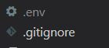
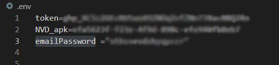
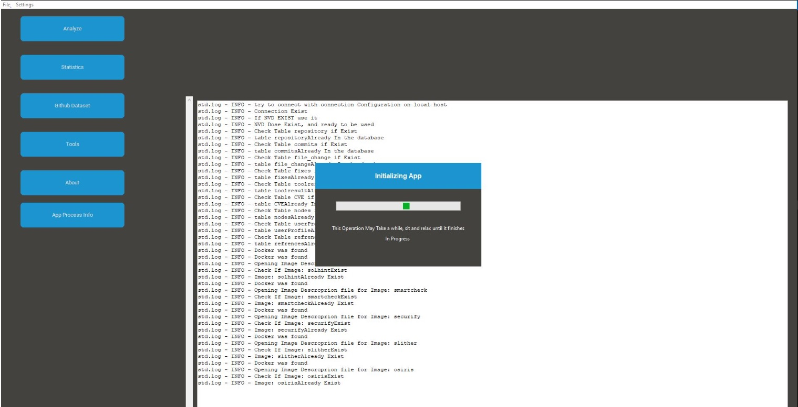
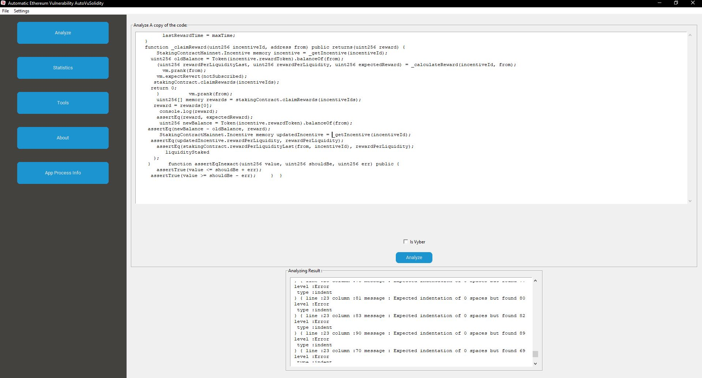
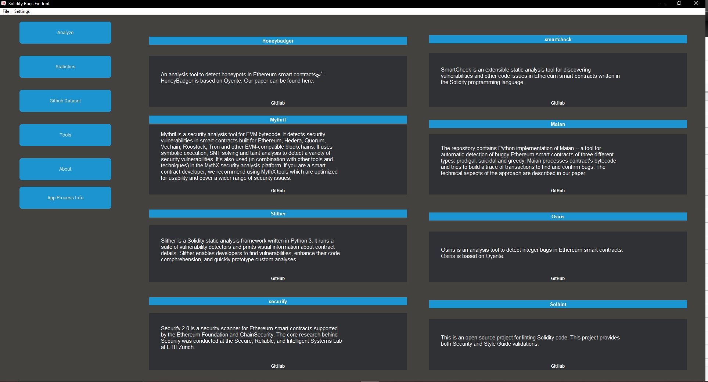
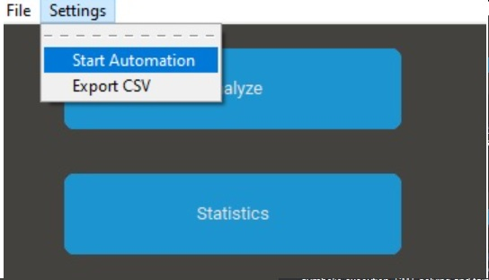
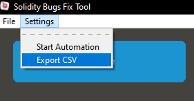

# AutoMESC: Automatic Framework for Mining and Classifying Ethereum Smart Contract Vulnerabilities and Their Fixes
Majd Soud, Ilham Qasse, Grischa Liebel, Mohammad Hamdaqa

Due to the risks associated with vulnerabilities in smart contracts, their security has gained significant attention in recent years.  
Towards this end, we propose an automated method for mining and classifying Ethereum smart contract vulnerabilities and corresponding fixes from GitHub and from Common Vulnerabilities and Exposures (CVE) records in the National Vulnerability Database. We implemented the proposed method in a fully automated framework, AutoMESC, that classifies and, using seven of the most well-known smart contract security tools, labels the collected vulnerabilities based on vulnerability types. Furthermore, AutoMESC collects metadata that can be used for smart contract security research, such as vulnerability detection, classification, severity prediction, and automated repair. Furthermore, AutoMESC is designed to collect data continuously and keep the corresponding dataset up-to-date with newly discovered smart contract vulnerabilities and their fixes from GitHub and CVE records. 

- For more information,email: majdsoud5@gmail.com 

 ## Technology used 
 - Python - tkinter
 - Docker
 - Sql server
 - solc-anlyzer

 
 ## Pre-request 
 -  [Tools for Visual Studio](https://visualstudio.microsoft.com/downloads/) at least 2015
 -  [Docker](https://www.docker.com/products/docker-desktop/) 
 -  [python 3](https://www.python.org/downloads/) and Above

 ## Tools Used 

 - [Smartcheck](https://github.com/smartdec/smartcheck)
 - [solhint](https://github.com/protofire/solhin)
 - [osiris](https://github.com/christoftorres/Osiris)
 - [securify](https://github.com/eth-sri/securify2)
 - [slither](https://github.com/crytic/slither)
 - [mythril](https://github.com/ConsenSys/mythril)
 - [maian](https://github.com/ivicanikolicsg/MAIAN)
 - [honeybadger](https://github.com/christoftorres/HoneyBadger)

 # Get started
 - create your own Github Access Token this [article will help you](https://catalyst.zoho.com/help/tutorials/githubbot/generate-access-token.html) 
 - create you Own [NVD API KEY](https://nvd.nist.gov/developers/request-an-api-key) 
 - activate python VE => & {path}/SolidityTool/myenv/Scripts/Activate.ps1
 - install packages => python -m pip install -U --force pip 
                       pip install -r /requirements.txt
 - creatr .env file with these variables 
    - token=(put you github Token here)
    - NVD_apk=(put you NVD key here)
     - emailPassword=(put [google app password](https://support.google.com/accounts/answer/185833) here)

    - your .env file will look like this

   

    - and your data in you env file sould look like this

    

 - run main window => python mainWindow.py

    ## Database Schema 
    - this app uses SQL Server as a Docker Image, all connections and creations of database and tables related to the following schema are maintained with the app itself.

 # Screens 
 - ### Logs Window 
 Logs Window shows all installation logs for all docker tools, main SQL docker image, and connection to the database from where you can see if any error occurs while the configuration step 

 

- ### Analyze Screen

  In this Screen You can Copy/Past your code and test it and get Errors in it as shown Below
  
 

 - ### Tools 
 Small Explenation about each tool used in this App with GitGub-Repo
 
 

 - ### Automation
  you can find it here and also export Your data as CSV format

        

  from here you can start your Automated Operation Of Collecting Github, CVES,and analyze them every 2 Hours, after launching the Background Process you will get a notification telling you that this is a scheduled process. 

